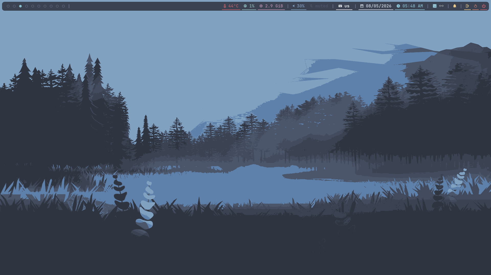
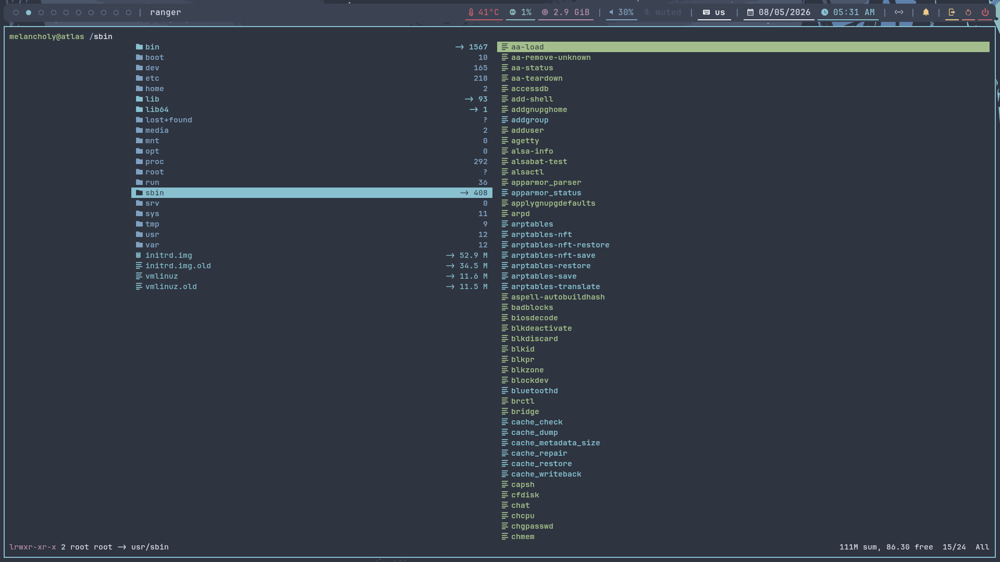
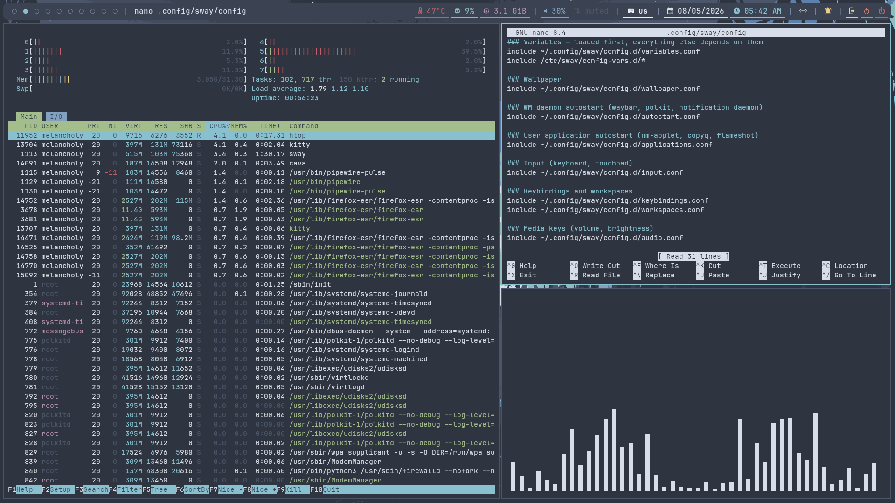
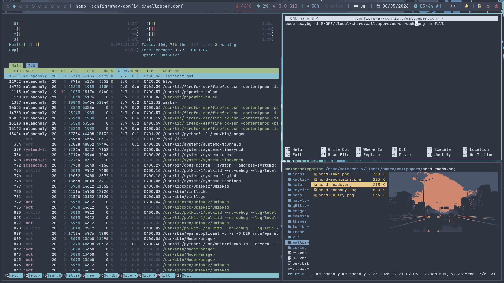
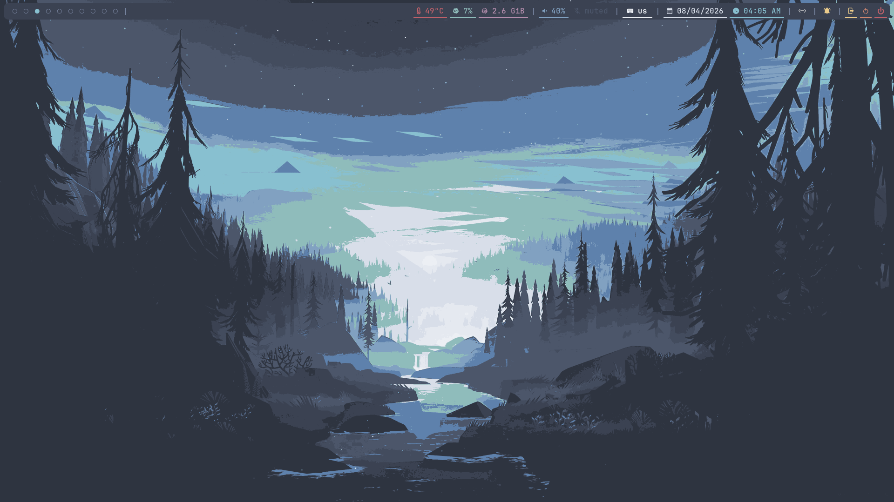
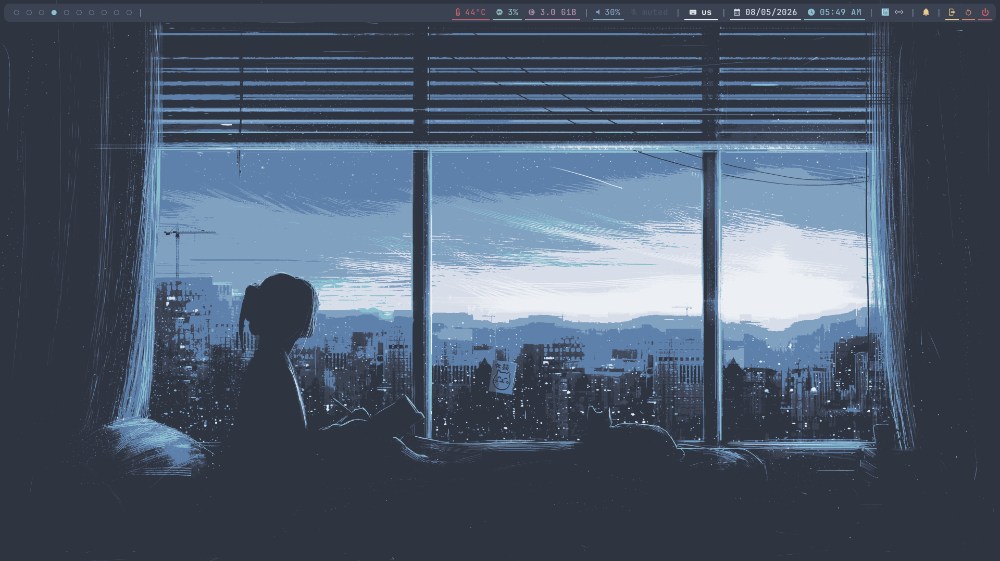

<h1 align="center">sway-dotfiles</h1>
<h3 align="center">🧊 Nordic-inspired, reproducible Sway/Wayland desktop.</h3>

<p align="center">
  
  
  
  
  
</p>

<p align="center">
  
</p>

<details>
<summary align="center"><b>🖼️ Gallery</b> <i>(click to expand)</i></summary>
<br>

<p align="center">
  
</p>
<p align="center">
  
</p>
<p align="center">
  
</p>
<p align="center">
  
</p>
<p align="center">
  
</p>

</details>

> **One script. A fresh Debian 13 install in, a fully themed Sway desktop out.**<br>
> Installs packages, fonts, icons, shell configuration, and dotfiles — non-interactively.

```bash
git clone https://github.com/rebootless/sway-dotfiles
cd sway-dotfiles
chmod +x install.sh
./install.sh
```
---

### 🧩 Included Software

<table align="center">
<tr>
<td align="center" width="50%">

**🪟 Window Manager & Bar**<br>
<a href="https://github.com/swaywm/sway"></a>
<a href="https://github.com/Alexays/Waybar"></a>

</td>
<td align="center" width="50%">

**🖥️ Terminal**<br>
<a href="https://github.com/kovidgoyal/kitty"></a>

</td>
</tr>
<tr>
<td align="center">

**🚀 Launcher & Notifications**<br>
<a href="https://hg.sr.ht/~scoopta/wofi"></a>
<a href="https://github.com/ErikReider/SwayNotificationCenter"></a>

</td>
<td align="center">

**📁 File Management**<br>
<a href="https://github.com/ranger/ranger"></a>
<a href="https://gitlab.xfce.org/xfce/thunar"></a>

</td>
</tr>
<tr>
<td align="center">

**📝 Editor & Browser**<br>
<a href="https://apps.kde.org/kate/"></a>
<a href="https://www.mozilla.org/firefox/"></a>

</td>
<td align="center">

**📡 Network, Bluetooth & Security**<br>
<a href="https://networkmanager.dev/"></a>
<a href="https://github.com/blueman-project/blueman"></a>
<a href="https://firewalld.org/"></a>

</td>
</tr>
<tr>
<td align="center">

**🔊 Audio**<br>
<a href="https://pipewire.org/"></a>
<a href="https://pipewire.pages.freedesktop.org/wireplumber/"></a>

</td>
<td align="center">

**📸 Screenshots & Clipboard**<br>
<a href="https://flameshot.org/"></a>
<a href="https://sr.ht/~emersion/grim/"></a>
<a href="https://sr.ht/~emersion/slurp/"></a>
<a href="https://github.com/hluk/CopyQ"></a>

</td>
</tr>
<tr>
<td align="center">

**🎵 Media Playback**<br>
<a href="https://github.com/cmus/cmus"></a>
<a href="https://www.videolan.org/vlc/"></a>
<a href="https://github.com/LukashonakV/cava"></a>

</td>
<td align="center">

**🎨 Theming**<br>
<a href="https://github.com/EliverLara/Nordic"></a>
<a href="https://github.com/zayronxio/Zafiro-icons"></a>

<a href="https://github.com/nwg-piotr/nwg-look"></a>


</td>
</tr>
<tr>
<td align="center" colspan="2">

**🔤 Fonts**<br>
<a href="https://github.com/ryanoasis/nerd-fonts"></a>
<a href="https://github.com/ryanoasis/nerd-fonts/tree/master/patched-fonts/JetBrainsMono"></a>
<a href="https://github.com/ryanoasis/nerd-fonts/tree/master/patched-fonts/FiraCode"></a>
<a href="https://github.com/ryanoasis/nerd-fonts/tree/master/patched-fonts/Hack"></a>
<a href="https://github.com/ryanoasis/nerd-fonts/tree/master/patched-fonts/Meslo"></a>
<a href="https://github.com/ryanoasis/nerd-fonts/tree/master/patched-fonts/SourceCodePro"></a>

</td>
</tr>
</table>

---

### 📋 Requirements

- **Debian 13 (trixie)** only — `install.sh` checks `/etc/os-release` and refuses anything else.
- A **regular sudo user**, not root — `sudo` and `git` must already be installed.
- A **minimal base install** (Debian installer, "Standard system utilities" only) — no existing DE, nothing pre-configured.
- An **internet connection** — apt, fonts, icons and the shell setup all pull from the network.

### ⚡ Installation Process

1. Installs packages via `scripts/install-pkgs-*.sh`
2. Installs Nerd Fonts, `ranger` devicons, and Zafiro icons.
3. Copies `dotfiles/` into `$HOME`
4. Sets up the shell and user dirs.
5. Enables NetworkManager, bluetooth and firewalld.

> [!IMPORTANT]
> ♻️ Re-running the installer **does not merge existing dotfiles**. Managed files are backed up and then overwritten on every run.

<details>
<summary><b>⌨️ Keybindings</b> <i>(click to expand)</i></summary>
<br>

`$mod` = **`Win`**

| Shortcut | Action |
|----------|--------|
| `$mod` + `Enter` | Open terminal |
| `$mod` + `D` | App launcher |
| `$mod` + `Shift` + `Q` | Close window |
| `$mod` + `Shift` + `C` | Reload config |
| `$mod` + `Shift` + `E` | Exit session |
| `$mod` + `← ↑ ↓ →` | Move focus |
| `$mod` + `Shift` + `← ↑ ↓ →` | Move window |
| `$mod` + `B` / `V` | Split horizontal / vertical |
| `$mod` + `E` | Toggle split layout |
| `$mod` + `S` / `W` | Stacking / tabbed layout |
| `$mod` + `F` | Fullscreen |
| `$mod` + `Shift` + `Space` | Toggle floating |
| `$mod` + `Space` | Switch tiling ↔ floating focus |
| `$mod` + `A` | Focus parent container |
| `$mod` + `Shift` + `-` / `-` | Send to / cycle scratchpad |
| `$mod` + `R` | Resize mode |
| `Print` | Screenshot |
| `Alt` + `Shift` | Switch keyboard layout |

</details>

### ✨ Acknowledgements

[Zafiro Icons](https://github.com/zayronxio/Zafiro-icons) · [Nordic](https://github.com/EliverLara/Nordic) · [Nerd Fonts](https://github.com/ryanoasis/nerd-fonts) · [Nordic Wallpapers](https://github.com/linuxdotexe/nordic-wallpapers)

<hr>

<p align="center">
  Licensed under the <a href="LICENSE">GNU GPL v3.0</a> license.
</p>
